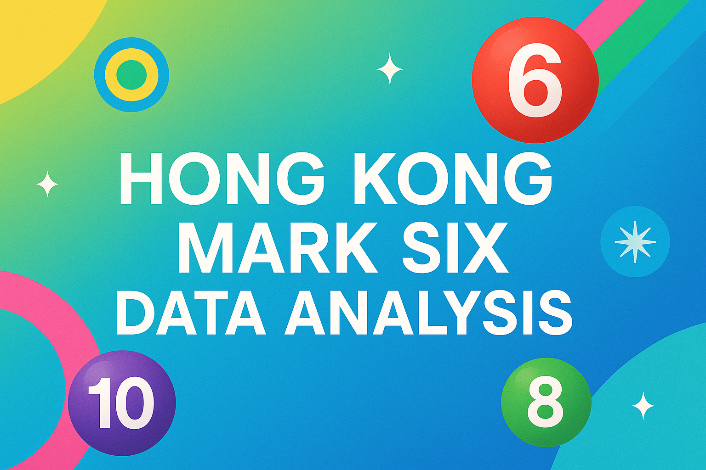

# Hong Kong Mark Six Data Analysis

  

This project provides a comprehensive, data-driven analysis of the Hong Kong Mark Six lottery, focusing on the statistical trends of drawn numbers and their associated colors. It includes:

## Project Structure

- `mark_six_number_color_trend_analysis.ipynb`: In-depth analysis of number and color trends, with visualizations and statistical explanations.
- `mark_six_pred.ipynb`: Demonstrates a hierarchical Extended Kalman Filter (EKF) model for prediction and evaluation.
- `get_lottery_data.py`: Utility for fetching and processing Mark Six draw data.
- `research/`: Folder containing 8 notebooks, each implementing a different prediction or analysis method.
  - `extreme_value_tail_dependence.ipynb`
  - `copula_dependence.ipynb`
  - `bayesian_hierarchical_frequencies.ipynb`
  - `fractal_multifractal_scaling.ipynb`
  - `information_theoretic_analysis.ipynb`
  - `polya_urn_reinforcement.ipynb`
  - `random_matrix_spectral.ipynb`
  - `renewal_interarrival.ipynb`

## Prediction Methods Overview

The `research` folder contains 8 different prediction and analysis methods, each implemented in a dedicated notebook:

- **Extreme Value Tail Dependence** (`extreme_value_tail_dependence`):
  - Applies extreme value theory (EVT) to analyze gaps between drawn numbers and their tail dependence, testing randomness and modeling rare events.
- **Copula Dependence** (`copula_dependence`):
  - Uses copula models to study joint dependence structures between lottery numbers, capturing complex relationships beyond linear correlation.
- **Bayesian Hierarchical Frequencies** (`bayesian_hierarchical_frequencies`):
  - Implements Bayesian hierarchical models to estimate and predict number frequencies, accounting for uncertainty and prior information.
- **Fractal & Multifractal Scaling** (`fractal_multifractal_scaling`):
  - Investigates fractal and multifractal properties in lottery number sequences, exploring scaling laws and self-similarity.
- **Information Theoretic Analysis** (`information_theoretic_analysis`):
  - Applies entropy and mutual information measures to quantify randomness, predictability, and information flow in draw results.
- **Polya Urn Reinforcement** (`polya_urn_reinforcement`):
  - Models reinforcement and memory effects in number selection using Polya urn processes, simulating non-independent draws.
- **Random Matrix Spectral Analysis** (`random_matrix_spectral`):
  - Uses random matrix theory to analyze spectral properties of number sequences, detecting hidden structure or anomalies.
- **Renewal Interarrival Analysis** (`renewal_interarrival`):
  - Studies the statistical properties of intervals between repeated number appearances, using renewal theory to model waiting times.

Each notebook provides code, visualizations, and statistical explanations for its respective method. These approaches offer diverse perspectives on lottery data, from classical statistics to modern machine learning and mathematical modeling.

## Requirements

- Python 3.11+
- pandas, matplotlib, seaborn, numpy, scipy, statsmodels, scikit-learn

## Background

The Hong Kong Mark Six lottery draws 6 numbers (from 1 to 49) and an extra number. Each number is assigned a color (red, blue, or green) based on a systematic rule. Since 2010-11-09, each bet costs HK$10, and the prize structure was updated to increase fixed prizes and the jackpot guarantee. (2010 年 11 月 9 日，每注金額由港幣 5 元加倍至港幣 10 元，固定獎金提高一倍，頭獎獎金保證由港幣 500 萬增至 800 萬。)

- [RTHK News: Mark Six Prize Structure Update (Archived)](https://web.archive.org/web/20140808052241/http://rthk.hk/rthk/news/expressnews/20100928/news_20100928_55_701445.htm)

## Data Source

- Data is sourced from the official Hong Kong Jockey Club website: [Mark Six Results](https://bet.hkjc.com/marksix/index.aspx?lang=en)
  The detailed GraphQL API endpoint implementations can be found in the `get_lottery_data.py` script.

## Disclaimer

This project is for educational and research purposes only. Lottery outcomes are random, and past trends do not influence future draws.
